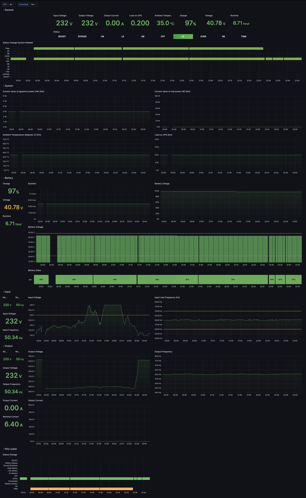

# UPS management based on NUT, Grafana, Prometheus and Docker Compose



Make sure you have installed NUT packages in your system. Initially, this projects support Mac OS.

TBR...

## Running

Run from root of project:
```
chmod +x ./deploy.sh
./deploy.sh
```
